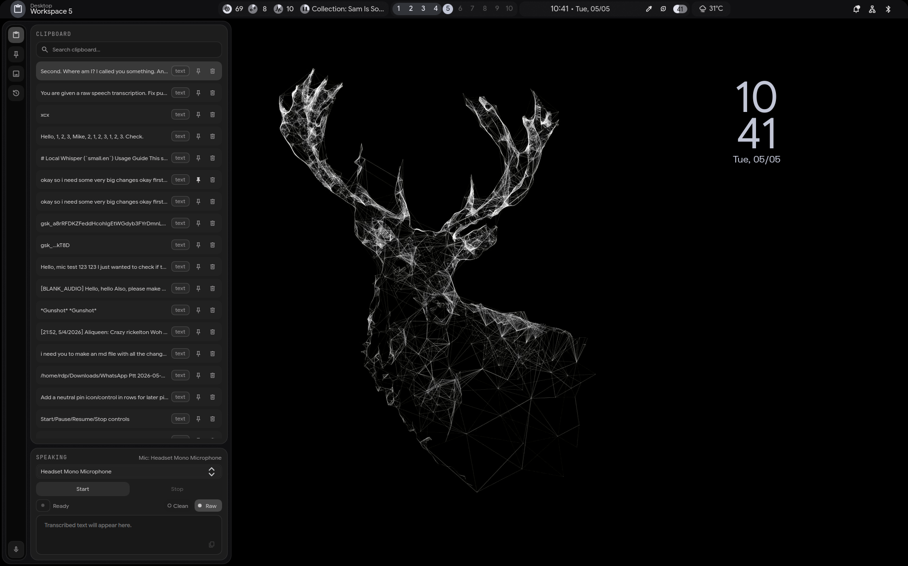

# Linux Config Notes

Personal Linux setup notes for Hyprland and Fish shell.

## Repo Contents

- `End-4/keybinds.txt`: Hyprland keybind and Wofi confirm-close snippets.
- `End-4/fish.txt`: Fish shell prompt and greeting config snippets.

## Wallpapers

All files in the `Wallpaper/` directory are maintained in `1920x1200` format.

## Custom Sidebar



The left sidebar was turned into a compact clipboard and speaking workflow with:

- An icon-only rail for Clipboard, Pinned, Images, and Transcribed.
- Clipboard search, pinning, delete actions, and full-message hover previews.
- Speaking controls with mic selection, pause/resume, and Clean/Raw transcription modes.

## Update End-4 Dots (Important)

Before updating [`end-4/dots-hyprland`](https://github.com/end-4/dots-hyprland), remove your custom Hyprland folder so old overrides do not conflict.

```bash
rm -rf ~/.config/hypr/custom
```

Then update and reinstall:

```bash
git pull
./install.sh
```

## Quick Edit Paths

```bash
nvim ~/.config/hypr/custom/keybinds.conf
nvim ~/.config/hypr/scripts/confirm-close.sh
nvim ~/.config/wofi/confirm.css
nvim ~/.config/fish/config.fish
chmod +x ~/.config/hypr/custom/scripts/confirm-close.sh
```
