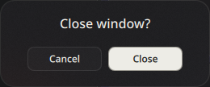
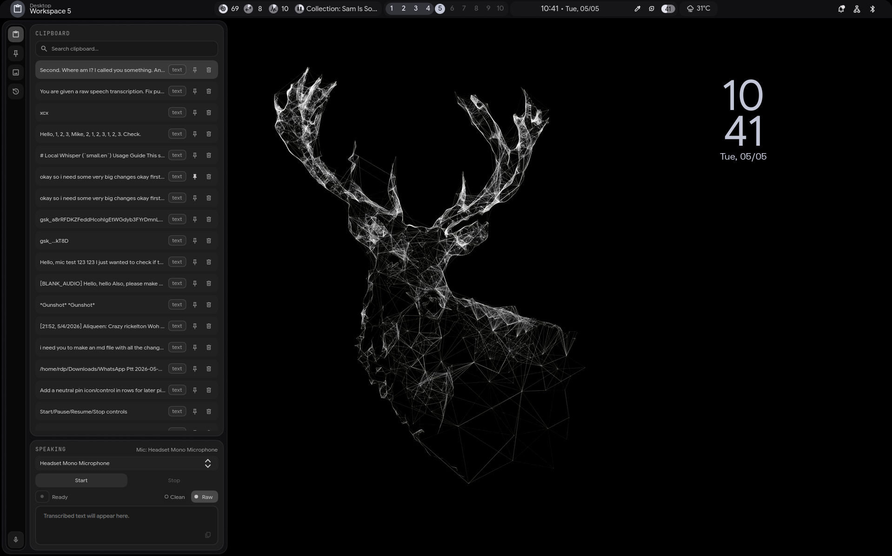

# Linux Config Notes

Personal Linux setup notes for Hyprland and Fish shell.

## Repo Contents

- `End-4/keybinds.txt`: Hyprland Lua keybind snippets.
- `End-4/confirm-close.sh`, `restore-closed.sh`, `window-close.py`, and `confirm-close.qml`: close confirmation and last-app reopening.
- `End-4/confirm-close-rules.lua`: blur and animation settings for the close dialog.
- `End-4/fish.txt`: Fish shell prompt and greeting config snippets.

## Wallpapers

All files in the `Wallpaper/` directory are maintained in `1920x1200` format.

## Close Confirmation



Super+Q opens a small charcoal dialog at 72% opacity with Close selected. Enter
closes the window immediately. Escape, Cancel, or clicking outside dismisses it.
Tab or arrow keys select a button; Enter or Space activates it. Repeated Super+Q
presses keep one dialog open. The selected window is captured before the dialog
opens, so a focus change cannot close another app.

Super+Shift+Q reopens the one most recently closed app. Only confirmed closes
through this dialog are remembered. Canceling or failing to close preserves the
previous entry; a successful reopen clears it. Native save prompts still work:
the controller waits for the requested window to actually disappear before
updating the entry.

Installed apps use their desktop launcher; AppImages use their original path.
VS Code preserves the selected project and profile when they can be identified
from its session metadata. Other window contents and unsaved state depend on the
app's own session restore. Missing or ambiguous project metadata falls back to
opening the app normally.

The runtime lock and dialog socket live under `$XDG_RUNTIME_DIR/hypr-close-*`.
The single restore entry is private and stored at
`${XDG_STATE_HOME:-~/.local/state}/hypr/window-close/last-closed.json`.

From this repository, install the four runtime files into each config copy:

```bash
install -m 755 End-4/confirm-close.sh End-4/restore-closed.sh End-4/window-close.py ~/.config/hypr/custom/scripts/
install -m 644 End-4/confirm-close.qml ~/.config/hypr/custom/scripts/
install -m 755 End-4/confirm-close.sh End-4/restore-closed.sh End-4/window-close.py ~/Desktop/dots-hyprland/dots/.config/hypr/custom/scripts/
install -m 644 End-4/confirm-close.qml ~/Desktop/dots-hyprland/dots/.config/hypr/custom/scripts/
```

Add the Super+Q and Super+Shift+Q blocks in `End-4/keybinds.txt` to each custom
`keybinds.lua`, and add `End-4/confirm-close-rules.lua` to each custom `rules.lua`.
The runtime requires Hyprland with Lua configuration, QuickShell, Python 3, and
PyGObject with GioUnix, which are present in this desktop setup.

```bash
python3 -m unittest discover -s End-4/tests
/usr/lib/qt6/bin/qmllint End-4/confirm-close.qml
hyprctl reload config-only
hyprctl configerrors
```

## Custom Sidebar



The left sidebar was turned into a compact clipboard and speaking workflow with:

- An icon-only rail for Clipboard, Pinned, Images, and Transcribed.
- Clipboard search, pinning, delete actions, and full-message hover previews.
- Speaking controls with mic selection, pause/resume, and Clean/Raw transcription modes.

## Update End-4 Dots (Important)

Before updating [`end-4/dots-hyprland`](https://github.com/end-4/dots-hyprland), remove your custom Hyprland folder so old overrides do not conflict.

```bash
rm -rf ~/.config/hypr/custom
```

Then update and reinstall:

```bash
git pull
./install.sh
```

## Quick Edit Paths

```bash
nvim ~/.config/hypr/custom/keybinds.lua
nvim ~/.config/hypr/custom/scripts/confirm-close.qml
nvim ~/.config/hypr/custom/scripts/window-close.py
nvim ~/.config/fish/config.fish
chmod +x ~/.config/hypr/custom/scripts/confirm-close.sh
```
